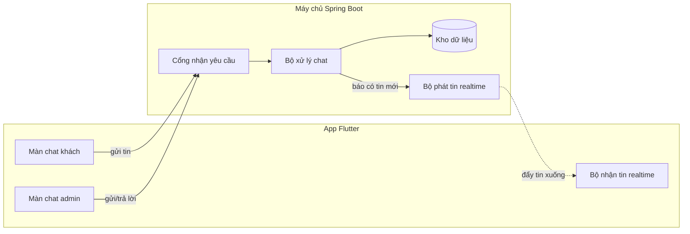
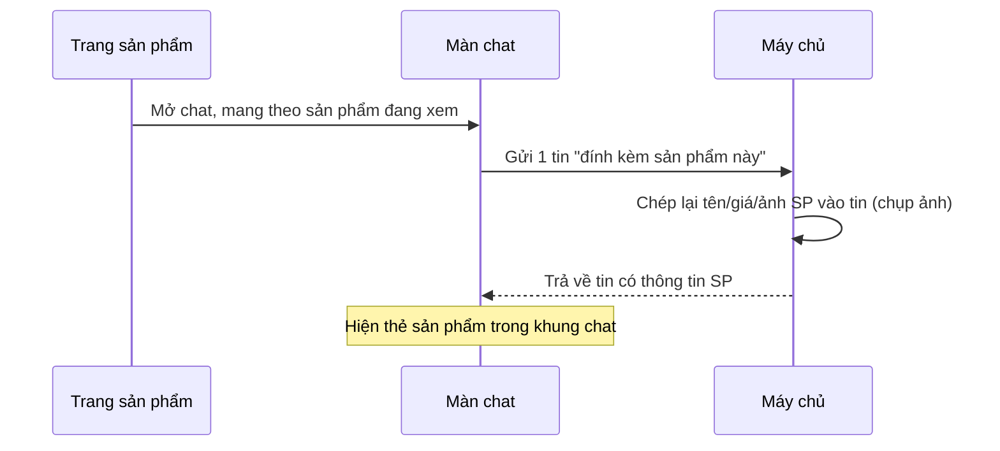

# Chức năng Chat hoạt động thế nào (giải thích dễ hiểu)

Tài liệu này giải thích tính năng chat giữa **Khách hàng** và **Nhân viên** bằng ngôn ngữ đời thường.
Có **2 phần phần mềm**:

- **Backend (BE)** = "máy chủ" đặt ở `D:\electroshop` (viết bằng Java/Spring Boot). Đây là nơi lưu dữ liệu và quyết định mọi việc.
- **Frontend (FE)** = "app điện thoại" đặt ở `D:\mobile-electro-shop\mobile_electroshops` (viết bằng Flutter). Đây là phần người dùng nhìn thấy.

> 📖 Gặp từ lạ? Kéo xuống mục **[Từ điển](#từ-điển-thuật-ngữ)** ở cuối file.

---

## 1. Ý tưởng chính (đọc cái này là hiểu 80%)

Hãy tưởng tượng chat giống **Zalo / Messenger**:

1. **Khách** nhắn cho **cửa hàng**. Mọi **nhân viên** đều thấy chung một danh sách hội thoại (như tổng đài chăm sóc khách hàng).
2. Khi gửi một tin, app **gửi tin lên máy chủ để lưu lại trước** (giống bỏ thư vào bưu điện). Lưu xong, máy chủ mới **báo cho người nhận** biết "có tin mới".
3. Việc **gửi tin đi** và **nhận tin về** đi theo 2 đường khác nhau:
   - **Gửi đi** → dùng cách "hỏi–đáp một lần" (gọi là **REST API**, giống gửi một lá thư rồi nhận thư trả lời).
   - **Nhận về** → dùng "đường dây luôn mở" (gọi là **WebSocket**, giống cuộc gọi điện không cúp máy — máy chủ có thể "nói" xuống app bất cứ lúc nào).
4. Mỗi khách chỉ có **một cuộc hội thoại đang mở**. App **không** tự chọn hội thoại nào — máy chủ tự biết bạn là ai nhờ **thẻ đăng nhập** (gọi là **JWT**). Nhờ vậy không ai xem trộm được hội thoại của người khác.
5. Một tin nhắn có thể **đính kèm 1 sản phẩm** (hiện ra cái thẻ nhỏ: ảnh + tên + giá), giống khi bạn chat với shop trên Shopee.

---

## 2. Hai vai trò khác nhau

| | **Khách hàng** | **Nhân viên (Admin)** |
|---|---|---|
| Thấy gì | 1 khung chat của riêng mình | Danh sách tất cả khách → bấm vào từng người để trả lời |
| Màn hình trong app | `ChatScreen` | `AdminConversationsScreen` → `AdminChatDetailScreen` |
| Nơi nhận tin mới | "hộp thư riêng" của mình | "loa phát thanh chung" cho cả đội |

> ⚠️ **Admin không được đóng vai khách.** Nếu tài khoản admin cố mở chat khách, máy chủ sẽ **từ chối**. (Vì sao? Xem [mục 6](#6-một-vài-quyết-định-quan-trọng-và-lý-do).)

---

## 3. Sơ đồ tổng thể



Cách đọc: app **gửi tin** lên *Cổng nhận yêu cầu* → *Bộ xử lý* **lưu vào kho** → rồi nhờ *Bộ phát tin* **đẩy tin mới** xuống các app đang mở.

---

## 4. Phần Máy chủ (Backend) làm gì

### 4.1 Dữ liệu được lưu thế nào

Có 2 "bảng" (như 2 sheet Excel):

**Bảng Hội thoại (`Conversation`)** — mỗi dòng là một cuộc chat của một khách:
- của khách nào, đang **mở** hay đã **đóng**, tin cuối lúc nào,
- "đã đọc tới đâu" của khách và của nhân viên (để biết còn bao nhiêu tin chưa đọc).

**Bảng Tin nhắn (`ChatMessage`)** — mỗi dòng là một tin:
- thuộc hội thoại nào, ai gửi (khách hay nhân viên), nội dung chữ,
- **nếu có đính kèm sản phẩm**: lưu sẵn tên + giá + ảnh sản phẩm ngay trong tin.

> 💡 **Vì sao lưu sẵn tên/giá sản phẩm vào tin?** Để cái thẻ sản phẩm trong chat **không bị sai về sau**. Nếu mai mốt sản phẩm đổi giá hay bị xoá, tin cũ vẫn hiện đúng giá lúc khách hỏi. Giống như **chụp màn hình** lại tại thời điểm đó.

### 4.2 Các "nút bấm" máy chủ cung cấp (API)

App khách gọi được:
- *Lấy hội thoại của tôi*
- *Tải lịch sử tin nhắn* (cuộn lên để xem tin cũ hơn)
- *Gửi một tin* (kèm sản phẩm nếu có)
- *Đánh dấu đã đọc*

App admin gọi được:
- *Lấy danh sách hội thoại*
- *Tải tin nhắn của một hội thoại*
- *Trả lời khách*
- *Đánh dấu đã đọc* / *Đóng hội thoại*

### 4.3 Khi một tin được gửi, máy chủ làm gì

1. **Lưu tin vào kho dữ liệu** (quan trọng nhất — không được mất tin).
2. **Báo cho người nhận**: đẩy tin xuống **đúng khách đó** *và* xuống **tất cả nhân viên** cùng lúc.
3. Nếu đây là **tin đầu tiên** của khách → máy chủ tự gửi **câu chào tự động** ("Cảm ơn bạn đã liên hệ ElectroShop...").

> Nếu phần "báo realtime" lỗi (mạng chập chờn) thì **chỉ ghi log, không huỷ tin**. Tin vẫn nằm trong kho, lần sau mở app vẫn thấy.

---

## 5. Phần App (Frontend) làm gì

### 5.1 Nơi giữ dữ liệu chung ("Provider")

Trong app, dữ liệu chat được giữ ở một chỗ chung gọi là **Provider** (giống một "kho tạm" mà nhiều màn hình cùng dùng):

- **Khách** dùng `ChatProvider`.
- **Admin** dùng `AdminChatProvider`.

Cái hay: app **giữ đường dây realtime mở sẵn** ngay khi đăng nhập, nên **con số đỏ báo tin chưa đọc** (badge) luôn cập nhật dù bạn chưa mở khung chat.

### 5.2 Các màn hình & mảnh ghép

```
Màn chat khách (ChatScreen)
 ├─ thanh tiêu đề
 ├─ danh sách tin nhắn
 │    └─ từng "bong bóng" tin (MessageBubble)
 │         ├─ tin của mình  → bên phải, màu xanh
 │         ├─ tin người kia → bên trái, có tên + avatar
 │         └─ thẻ sản phẩm  → khi tin có đính kèm SP
 └─ ô soạn tin
```

- **Bong bóng tin (`MessageBubble`)** dùng chung cho cả màn khách lẫn màn admin. Quy tắc: **tin của phía đang xem** thì nằm **bên phải màu xanh**, tin của người kia nằm **bên trái**.
- **Thẻ sản phẩm (`_ProductCard`)** hiện khi tin có đính kèm sản phẩm. Bấm vào thẻ → mở lại trang chi tiết sản phẩm.

---

## 6. Đính kèm sản phẩm — luồng từ A đến Z

Khi khách đang xem một sản phẩm và bấm nút **chat**:



Kết quả: đầu cuộc trò chuyện hiện một **thẻ sản phẩm** (ảnh + tên + giá), giống Shopee. Nhân viên nhìn vào là biết khách đang hỏi về món nào.

---

## 7. Một vài quyết định quan trọng (và lý do)

| Quyết định | Nói dễ hiểu | Vì sao |
|---|---|---|
| Khách không tự gửi "mã hội thoại", máy chủ tự biết qua thẻ đăng nhập | App chỉ nói "tôi muốn xem chat của tôi", máy chủ tự tra ai là ai | Tránh người này **xem trộm** chat người khác |
| Lưu vào kho trước, báo realtime sau | Cất thư an toàn rồi mới rung chuông báo | Mạng lỗi cũng **không mất tin** |
| Lưu sẵn tên/giá SP vào tin | Chụp ảnh thông tin SP lúc gửi | Tin cũ **không bị sai** khi SP đổi giá/bị xoá |
| Chặn admin mở chat khách (cả ở app lẫn máy chủ) | Admin không "tự nhắn với chính mình" | Tránh hội thoại vô lý + đúng vai trò |
| Giữ đường dây realtime mở sẵn | Luôn online ngầm | **Số đỏ tin chưa đọc** luôn đúng |

---

## 8. Khi sửa code cần nhớ

- **Sửa máy chủ (BE)** → phải **khởi động lại máy chủ** thì thay đổi mới có tác dụng. Bảng tin nhắn sẽ tự thêm các cột sản phẩm mới ở môi trường **dev**. (Lên **production** phải tự thêm cột — hỏi tôi nếu cần file lệnh SQL.)
- **Sửa app (FE)** phần dữ liệu/model → bấm **`R`** (khởi động lại app), **không** dùng `r` (nạp nóng).
- **Không nhận được tin realtime?** Kiểm tra thẻ đăng nhập và địa chỉ kết nối `ws://<máy chủ>:8080/ws-native`.

---

## Từ điển thuật ngữ

| Từ | Nghĩa dễ hiểu |
|---|---|
| **Backend (BE)** | Máy chủ — nơi lưu dữ liệu, xử lý logic. Người dùng không nhìn thấy. |
| **Frontend (FE)** | App / giao diện người dùng nhìn thấy và bấm. |
| **REST API** | Cách app "hỏi–đáp một lần" với máy chủ: gửi yêu cầu → nhận trả lời. Giống gửi thư. |
| **WebSocket** | "Đường dây luôn mở" giữa app và máy chủ. Máy chủ có thể chủ động "nói" xuống app bất cứ lúc nào. Giống cuộc gọi không cúp máy. |
| **Realtime** | "Tức thì" — tin tới ngay, không cần bấm refresh. |
| **STOMP** | "Quy ước nói chuyện" chạy bên trên WebSocket (định dạng tin nhắn để 2 bên hiểu nhau). |
| **Subscribe (đăng ký nghe)** | App nói với máy chủ "có gì mới ở kênh X thì báo tôi". |
| **Hộp thư riêng (queue)** | Kênh **riêng** một người — chỉ đúng khách đó nhận tin. |
| **Loa phát thanh (topic)** | Kênh **chung** — mọi nhân viên đăng ký đều nhận cùng lúc. |
| **Đẩy tin (fanout)** | Máy chủ gửi một tin ra **nhiều nơi** cùng lúc (khách + cả đội nhân viên). |
| **JWT (thẻ đăng nhập)** | Tấm "thẻ" mã hoá chứng minh bạn là ai, gửi kèm mỗi yêu cầu. Máy chủ đọc thẻ để biết bạn là khách hay admin. |
| **Kho dữ liệu (Database)** | Nơi lưu trữ lâu dài mọi tin nhắn, hội thoại. |
| **Entity / Bảng** | Một "loại dữ liệu" trong kho, giống một sheet Excel (vd: bảng Tin nhắn). |
| **Snapshot (chụp ảnh)** | Sao chép lại thông tin tại một thời điểm để sau này không bị thay đổi. |
| **Provider** | "Kho tạm" trong app, giữ dữ liệu cho nhiều màn hình cùng dùng. |
| **Badge** | Con số đỏ nhỏ báo số tin chưa đọc. |
| **IDOR (xem trộm)** | Lỗ hổng cho phép đổi mã số để xem dữ liệu của người khác. Ở đây ta phòng tránh bằng cách máy chủ tự suy ra người dùng từ thẻ đăng nhập. |
| **Production (prod) / Dev** | "prod" = bản thật khách đang dùng; "dev" = bản chạy thử khi lập trình. |
