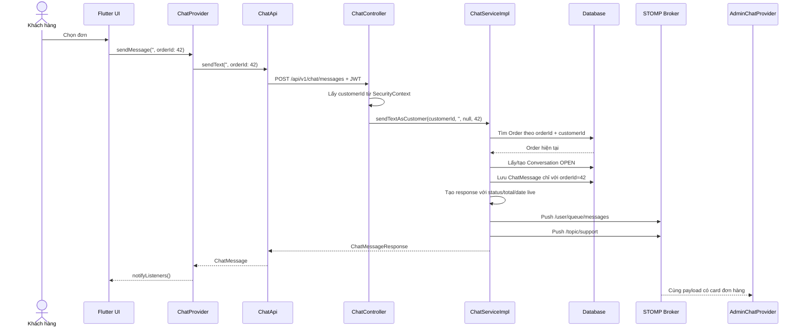

# Chat và card đơn hàng: từ cấu hình đến luồng hoạt động

Tài liệu này giải thích cách chức năng chat của ElectroShop hoạt động ở cả hai phía:

- Backend Spring Boot: `D:\electroshop`
- Mobile Flutter: `D:\mobile-electro-shop\mobile_electroshops`

Trọng tâm là luồng khách hàng đính kèm đơn hàng vào chat, cách backend bảo vệ dữ liệu và cách Flutter lấy dữ liệu để dựng card đơn hàng.

> Tài liệu tổng quan cũ nằm tại `docs/CHAT_ARCHITECTURE.md`. File này đi sâu hơn vào cấu hình kỹ thuật và card đơn hàng live.

---

## 1. Ý tưởng cốt lõi

Chat sử dụng hai đường truyền khác nhau:

```text
Gửi tin: Flutter → REST API → Spring Boot → Database
Nhận tin: Spring Boot → WebSocket/STOMP → Flutter Provider → UI
```

- REST API chịu trách nhiệm gửi tin, tải lịch sử và đánh dấu đã đọc.
- WebSocket/STOMP chỉ dùng để nhận tin mới theo thời gian thực.
- Database là nguồn dữ liệu chính. Tin phải được lưu thành công trước khi đẩy realtime.
- JWT giúp backend biết người đang thao tác là ai và có vai trò gì.

Luồng tổng quát:

```mermaid
flowchart LR
    UI[Flutter UI] -->|POST/GET/PATCH + JWT| API[REST Controller]
    API --> SERVICE[ChatServiceImpl]
    SERVICE --> DB[(Conversation + ChatMessage + Order)]
    SERVICE -->|STOMP push| CUSTOMER[/user/queue/messages]
    SERVICE -->|STOMP push| STAFF[/topic/support]
    CUSTOMER --> CP[ChatProvider]
    STAFF --> AP[AdminChatProvider]
    CP --> CARD[MessageBubble / OrderAttachmentCard]
    AP --> CARD
```

Điểm cần nhớ:

1. Flutter không gửi tin chat qua WebSocket.
2. Flutter gửi qua REST để backend kiểm tra quyền và lưu database.
3. Sau khi lưu, backend đẩy cùng một DTO qua WebSocket cho khách và nhân viên.
4. REST response và WebSocket payload dùng chung cấu trúc `ChatMessageResponse`.

---

## 2. Bản đồ các thành phần

### Backend

| Thành phần | Vai trò |
|---|---|
| `SecurityConfig` | Bảo vệ REST API, cho phép WebSocket handshake đi qua |
| `JwtAuthFilter` | Đọc JWT của REST request và đưa user vào `SecurityContext` |
| `WebSocketConfig` | Khai báo endpoint WebSocket và các prefix STOMP |
| `JwtChannelInterceptor` | Xác thực JWT ở STOMP `CONNECT`, bảo vệ topic admin |
| `ChatController` | REST API chat của khách hàng |
| `AdminChatController` | REST API quản lý chat của admin |
| `ChatServiceImpl` | Xử lý nghiệp vụ, lưu tin, lấy lịch sử, fanout realtime |
| `Conversation` | Lưu hội thoại và con trỏ đã đọc |
| `ChatMessage` | Lưu nội dung tin và dữ liệu đính kèm |
| `ChatMessageResponse` | DTO dùng chung cho REST và WebSocket |

### Flutter

| Thành phần | Vai trò |
|---|---|
| `ApiConfig` | Tạo `baseUrl` và `wsUrl` theo môi trường chạy |
| `ChatApi` | Gửi tin, tải lịch sử và đánh dấu đã đọc qua REST |
| `ChatSocket` | Kết nối STOMP và subscribe kênh realtime |
| `ChatProvider` | Quản lý state chat phía khách |
| `AdminChatProvider` | Quản lý danh sách hội thoại và chat phía admin |
| `ChatScreen` | Màn hình chat khách hàng |
| `ChatInputBar` | Gửi text, quick reply hoặc chọn đơn hàng |
| `OrderPickerSheet` | Tải danh sách đơn và trả về `orderId` được chọn |
| `MessageBubble` | Chọn loại nội dung cần render trong một tin |
| `OrderAttachmentCard` | Hiển thị card đơn hàng live |

---

## 3. Cấu hình backend

### 3.1. Spring Security cho REST và WebSocket

File: `D:\electroshop\src\main\java\com\sba302\electroshop\config\SecurityConfig.java`

REST API chat không phải public. Mọi request chat phải mang JWT:

```http
Authorization: Bearer <access-token>
```

Riêng đường dẫn `/ws-native/**` được `permitAll()` ở lớp HTTP vì đây mới chỉ là bước WebSocket handshake. JWT thật sự được kiểm tra ở STOMP `CONNECT` bởi `JwtChannelInterceptor`.

```text
WebSocket HTTP handshake → được phép đi qua
STOMP CONNECT + JWT       → được JwtChannelInterceptor xác thực
STOMP SUBSCRIBE           → tiếp tục kiểm tra quyền theo destination
```

`JwtAuthFilter` xử lý REST theo các bước:

1. Đọc header `Authorization`.
2. Bỏ tiền tố `Bearer `.
3. Gọi `JwtUtil.validateToken()`.
4. Lấy `userId`, role và privilege từ token.
5. Tạo `UsernamePasswordAuthenticationToken`.
6. Gắn authentication vào `SecurityContextHolder`.

Nhờ đó `ChatController` lấy được ID người dùng bằng:

```java
Authentication auth = SecurityContextHolder.getContext().getAuthentication();
Integer customerId = Integer.parseInt(auth.getName());
```

Khách không tự gửi `customerId` hoặc `conversationId` trong API gửi tin. Backend suy ra người dùng từ JWT để tránh xem hoặc ghi dữ liệu của người khác.

### 3.2. Cấu hình WebSocket/STOMP

File: `D:\electroshop\src\main\java\com\sba302\electroshop\config\WebSocketConfig.java`

```java
registry.addEndpoint("/ws-native").setAllowedOriginPatterns("*");

registry.enableSimpleBroker("/topic", "/queue");
registry.setApplicationDestinationPrefixes("/app");
registry.setUserDestinationPrefix("/user");
```

Ý nghĩa:

- `/ws-native`: endpoint WebSocket raw dành cho Flutter, không dùng SockJS.
- `/topic`: kênh broadcast, một tin có thể được nhiều admin nhận.
- `/queue`: hàng đợi riêng cho một người dùng.
- `/user`: prefix để Spring ánh xạ `/user/queue/messages` tới đúng user.
- `/app`: prefix cho message client gửi vào `@MessageMapping`; luồng chat hiện tại không dùng vì client gửi tin bằng REST.

Hai destination đang sử dụng:

| Destination | Người nhận |
|---|---|
| `/user/queue/messages` | Đúng khách hàng của hội thoại |
| `/topic/support` | Tất cả tài khoản admin đang subscribe |

### 3.3. JWT trên STOMP

File: `D:\electroshop\src\main\java\com\sba302\electroshop\config\JwtChannelInterceptor.java`

Khi Flutter gửi frame `CONNECT`, interceptor:

1. Đọc native header `Authorization`.
2. Kiểm tra token hợp lệ.
3. Lấy `userId` và roles.
4. Tạo `Authentication` có principal là `WsUserPrincipal(userId)`.
5. Gọi `accessor.setUser(auth)`.

Khi client `SUBSCRIBE /topic/support`, interceptor chỉ cho phép authority `ROLE_ADMIN`. Khách hàng vẫn được subscribe queue riêng, nhưng không thể nghe kênh hỗ trợ chung của nhân viên.

### 3.4. Cấu hình auto reply

File: `D:\electroshop\src\main\java\com\sba302\electroshop\config\ChatProperties.java`

Prefix cấu hình là `app.chat`. Nếu không khai báo property, hệ thống dùng câu mặc định:

```properties
app.chat.auto-reply-message=Cảm ơn bạn đã liên hệ ElectroShop. Nhân viên sẽ phản hồi sớm nhất có thể.
```

Câu này chỉ được gửi khi khách tạo tin đầu tiên trong hội thoại.

### 3.5. Cấu hình database

Môi trường development hiện dùng:

```properties
spring.jpa.hibernate.ddl-auto=update
```

Hibernate có thể tự bổ sung cột khi chạy local. Môi trường production dùng:

```properties
spring.jpa.hibernate.ddl-auto=validate
```

Vì vậy production phải có migration tạo cột `order_id` trong `CHAT_MESSAGES` trước khi deploy code mới. `validate` chỉ kiểm tra schema, không tự sửa database.

---

## 4. Cấu hình Flutter

### 4.1. Địa chỉ REST và WebSocket

File: `lib/core/utils/api_config.dart`

```dart
static String get baseUrl => ...; // http://<host>:8080

static String get wsUrl =>
    '${baseUrl.replaceFirst('http', 'ws')}/ws-native';
```

Ví dụ:

```text
REST:      http://192.168.1.11:8080
WebSocket: ws://192.168.1.11:8080/ws-native
```

Các trường hợp thường dùng:

- Android Emulator: đặt `useEmulator = true`, host là `10.0.2.2`.
- Điện thoại thật cùng Wi-Fi: đặt `useEmulator = false` và truyền IP LAN của máy chạy backend.
- Web/iOS simulator trên máy phát triển: dùng `localhost`.

Có thể truyền host khi chạy:

```bash
flutter run --dart-define=API_HOST=192.168.1.20
```

### 4.2. Đăng ký Provider

File: `lib/main.dart`

`ChatProvider` và `AdminChatProvider` được đăng ký ở cấp ứng dụng bằng `MultiProvider`. Mỗi provider có:

- một REST API client;
- một `ChatSocket`;
- hàm đọc access token từ `SharedPreferences`.

`MainScreen` gọi provider phù hợp theo role:

```text
CUSTOMER → ChatProvider.start()
ADMIN    → AdminChatProvider.start()
```

Kết nối socket được giữ khi rời màn chat để badge chưa đọc vẫn cập nhật.

### 4.3. Cấu hình STOMP phía Flutter

File: `lib/services/chat_socket.dart`

```dart
StompConfig(
  url: wsUrl,
  stompConnectHeaders: {'Authorization': 'Bearer $token'},
  webSocketConnectHeaders: {'Authorization': 'Bearer $token'},
  reconnectDelay: const Duration(seconds: 5),
  heartbeatIncoming: const Duration(seconds: 10),
  heartbeatOutgoing: const Duration(seconds: 10),
)
```

JWT bắt buộc phải có trong `stompConnectHeaders` vì backend đọc native header của frame STOMP `CONNECT`. `webSocketConnectHeaders` được gửi thêm cho lớp handshake.

---

## 5. Database và cấu trúc dữ liệu chat

### 5.1. `Conversation`

Một khách hàng có tối đa một hội thoại `OPEN` tại một thời điểm.

Các field quan trọng:

| Field | Ý nghĩa |
|---|---|
| `customer_id` | Chủ sở hữu hội thoại |
| `status` | `OPEN` hoặc `CLOSED` |
| `last_message_at` | Dùng sắp xếp inbox admin |
| `last_read_by_customer_msg_id` | Khách đã đọc tới message ID nào |
| `last_read_by_staff_msg_id` | Nhân viên đã đọc tới message ID nào |

Hai field `last_read_*` là cursor. Không cần lưu một bản ghi “đã đọc” cho từng message.

### 5.2. `ChatMessage`

Các field chung:

```text
id, conversation, sender, senderRole, content, createdAt
```

Field card sản phẩm:

```text
productId, productName, productImageUrl, productPrice
```

Field card đơn hàng:

```text
orderId
```

`orderId` là cột số nguyên bình thường, không phải quan hệ JPA `@ManyToOne`. Backend chủ động truy vấn `Order` khi cần trả response.

---

## 6. Vì sao sản phẩm dùng snapshot nhưng đơn hàng dùng dữ liệu live?

| Loại card | Dữ liệu lưu trong `CHAT_MESSAGES` | Lý do |
|---|---|---|
| Sản phẩm | ID, tên, ảnh, giá | Giữ đúng thông tin tại thời điểm khách hỏi, dù sản phẩm đổi giá/tên sau này |
| Đơn hàng | Chỉ `orderId` | Trạng thái giao hàng thay đổi theo thời gian nên cần hiển thị dữ liệu hiện tại |

Ví dụ card đơn được gửi lúc trạng thái là `PENDING`:

```text
10:00 gửi card      → PENDING
12:00 kho xử lý     → PROCESSING
15:00 đơn xuất kho  → SHIPPED
```

Khi người dùng mở lại lịch sử lúc 15:00, backend lấy `Order` hiện tại và card hiển thị `SHIPPED`. Đây là ý nghĩa của “card live”.

---

## 7. REST API của chat

### 7.1. API khách hàng

Base path: `/api/v1/chat`

| Method | Endpoint | Công dụng |
|---|---|---|
| `GET` | `/conversation` | Lấy hoặc tạo hội thoại đang mở |
| `GET` | `/conversation/messages?before=&size=20` | Lấy lịch sử mới → cũ |
| `POST` | `/messages` | Gửi text, card sản phẩm hoặc card đơn hàng |
| `PATCH` | `/conversation/read` | Đánh dấu khách đã đọc |

Request gửi card đơn hàng:

```http
POST /api/v1/chat/messages
Authorization: Bearer <access-token>
Content-Type: application/json

{
  "content": "",
  "orderId": 42
}
```

`content` được phép rỗng khi có `productId` hoặc `orderId`.

Response minh họa:

```json
{
  "data": {
    "id": 101,
    "conversationId": 9,
    "senderRole": "CUSTOMER",
    "senderName": "Trần Xuân Bắc",
    "content": "",
    "productId": null,
    "productName": null,
    "productImageUrl": null,
    "productPrice": null,
    "orderId": 42,
    "orderStatus": "PROCESSING",
    "orderTotal": 8991000,
    "orderDate": "2026-07-18T09:30:00",
    "read": false,
    "createdAt": "2026-07-18T12:00:00"
  }
}
```

### 7.2. API admin

Base path: `/api/v1/admin/chat`

| Method | Endpoint | Công dụng |
|---|---|---|
| `GET` | `/conversations` | Danh sách hội thoại |
| `GET` | `/conversations/{id}/messages` | Lịch sử một hội thoại |
| `POST` | `/conversations/{id}/messages` | Nhân viên trả lời |
| `PATCH` | `/conversations/{id}/read` | Đánh dấu nhân viên đã đọc |
| `PATCH` | `/conversations/{id}/close` | Đóng hội thoại |

`AdminChatController` dùng `@PreAuthorize("hasRole('ADMIN')")`; `ChatController` dùng `@PreAuthorize("!hasRole('ADMIN')")`.

---

## 8. Hai cách lấy và gửi card đơn hàng từ Flutter

Mọi trạng thái đều có thể đính kèm:

```text
PENDING, CONFIRMED, PROCESSING, SHIPPED,
DELIVERED, CANCELLED, REFUNDED
```

Nếu backend bổ sung trạng thái mới, card vẫn xuất hiện và hiển thị nguyên tên trạng thái; chỉ cần thêm mapping nếu muốn nhãn tiếng Việt và màu riêng.

### Cách 1: từ màn chi tiết đơn hàng

File: `lib/features/order/screens/order_detail_screen.dart`

Khi bấm **Hỏi về đơn này**:

```dart
Navigator.push(
  context,
  MaterialPageRoute(
    builder: (_) => ChatScreen(attachOrderId: order.orderId),
  ),
);
```

`ChatScreen` nhận `attachOrderId`, vào chat và tự gửi:

```dart
await provider.enterChat();
await provider.sendMessage('', orderId: orderId);
```

Vì vậy card được gửi ngay khi màn chat mở xong.

### Cách 2: từ nút `+` trong ô chat

Các bước:

```text
ChatInputBar
→ showOrderPicker()
→ OrderPickerSheet
→ OrderProvider.fetchAttachableOrders()
→ GET /api/v1/orders/user/{userId}?page=0&size=100
→ khách chọn một đơn
→ Navigator.pop(orderId)
→ ChatProvider.sendMessage('', orderId: orderId)
```

`OrderProvider` dùng state riêng `attachableOrders`, không ghi đè danh sách của màn lịch sử đơn hàng.

Picker chỉ giúp chọn đơn ở UI. Backend vẫn phải kiểm tra lại quyền sở hữu khi gửi card; không được tin hoàn toàn vào `orderId` do client gửi lên.

---

## 9. Luồng gửi card đơn hàng từng bước



Giải thích chi tiết:

1. Flutter chỉ gửi `orderId`, không gửi `orderStatus` hoặc `orderTotal`.
2. `ChatController` lấy `customerId` từ JWT.
3. `ChatServiceImpl.loadOrderOwnedByCustomer()` truy vấn đồng thời `orderId` và `customerId`.
4. Nếu đơn không thuộc khách, backend trả “Không tìm thấy đơn hàng”.
5. Service lấy hoặc tạo một `Conversation OPEN` của khách.
6. `saveMessage()` lưu nội dung và `orderId` vào `CHAT_MESSAGES`.
7. `ChatMessageResponse.from(message, read, order)` lấy trạng thái, tổng tiền và ngày đặt từ `Order` hiện tại.
8. Backend trả REST response cho người gửi.
9. Backend đồng thời push payload tới queue của khách và topic của admin.
10. Provider chống trùng message bằng ID vì người gửi có thể nhận cả REST response lẫn WebSocket push.

---

## 10. Cách backend chống IDOR khi lấy card

IDOR là lỗi cho phép người dùng đổi một ID trên request để truy cập dữ liệu của người khác.

Cách không an toàn:

```java
orderRepository.findById(orderId);
```

Nếu chỉ làm vậy, khách A có thể thử `orderId` của khách B.

Cách hiện tại:

```java
orderRepository.findByOrderIdAndUser_UserId(orderId, customerId)
    .orElseThrow(() -> new ResourceNotFoundException("Không tìm thấy đơn hàng"));
```

Điểm tốt:

- `customerId` lấy từ JWT, không lấy từ request body.
- Điều kiện quyền sở hữu nằm ngay trong query.
- Thông báo lỗi chung không tiết lộ đơn đó có tồn tại nhưng thuộc người khác hay không.
- Backend chấp nhận mọi trạng thái đơn, nhưng luôn yêu cầu đúng chủ sở hữu.

---

## 11. Cách lịch sử chat lấy trạng thái đơn live

Khi tải lịch sử, `ChatServiceImpl.loadHistory()` không query từng đơn một.

Luồng xử lý:

```text
Lấy một page ChatMessage
→ lấy tất cả orderId khác null
→ gom thành Set để bỏ trùng
→ orderRepository.findAllById(...)
→ tạo Map<orderId, Order>
→ map từng ChatMessage thành ChatMessageResponse
```

Ý tưởng rút gọn:

```java
Map<Integer, Order> ordersById = orderRepository
    .findAllById(orderIds)
    .stream()
    .collect(toMap(Order::getOrderId, identity()));

return messages.stream()
    .map(message -> ChatMessageResponse.from(
        message,
        isRead(message, conversation),
        ordersById.get(message.getOrderId())))
    .toList();
```

Đây là cách tránh lỗi hiệu năng N+1:

```text
Không tốt: 1 query lấy 20 message + tối đa 20 query lấy order
Hiện tại: 1 query lấy 20 message + 1 query lấy toàn bộ order liên quan
```

`ChatProvider.enterChat()` luôn tải page lịch sử gần nhất. Nếu lịch sử đã có, `_mergeRecentHistory()` thay message cũ bằng response mới. Nhờ đó card đơn cập nhật trạng thái live khi người dùng mở lại màn chat.

---

## 12. Cách Flutter dựng card từ response

### 12.1. Parse JSON

File: `lib/models/chat_message.dart`

Các field đơn hàng:

```dart
final int? orderId;
final String? orderStatus;
final num? orderTotal;
final DateTime? orderDate;

bool get hasOrder => orderId != null;
```

`ChatMessage.fromJson()` chuyển JSON thành model Dart. `orderDate` được parse bằng `DateTime.parse()`.

### 12.2. Chọn widget card

File: `lib/features/chat/widgets/message_bubble.dart`

```dart
if (message.hasProduct) _ProductCard(message: message),
if (message.hasOrder) OrderAttachmentCard(message: message),
if (message.content.isNotEmpty) ...
```

Một tin chỉ có card và `content = ""` vẫn hiển thị bình thường. Bong bóng text chỉ được dựng khi content không rỗng.

### 12.3. Hiển thị card

File: `lib/features/chat/widgets/order_attachment_card.dart`

Card sử dụng:

| Field | Vị trí hiển thị |
|---|---|
| `orderId` | Mã đơn `#42` |
| `orderStatus` | Badge trạng thái |
| `orderTotal` | Tổng tiền, định dạng VND |
| `orderDate` | Ngày đặt `dd/MM/yyyy` |

Nếu `orderStatus == null`, card dùng nhãn **Đang cập nhật**. Nếu `orderTotal` hoặc `orderDate` null, dòng tương ứng không được render.

Khi bấm card:

```dart
OrderDetailScreen(orderId: '$orderId')
```

Màn chi tiết tự gọi API đơn hàng để lấy toàn bộ dữ liệu mới nhất.

### 12.4. Mapping trạng thái và màu

File: `lib/features/order/widgets/order_status_utils.dart`

| Status backend | Nhãn Flutter | Màu chính |
|---|---|---|
| `PENDING` | Chờ xử lý | Cam |
| `CONFIRMED` | Đã xác nhận | Indigo |
| `PROCESSING` | Đang chuẩn bị | Tím |
| `SHIPPED` | Đang giao hàng | Xanh dương |
| `DELIVERED` | Đã giao hàng | Xanh thành công |
| `CANCELLED` | Đã hủy | Đỏ |
| `REFUNDED` | Đã hoàn tiền | Đỏ |

Status chưa có trong switch vẫn hiện nguyên chuỗi với màu mặc định, vì vậy không làm mất card.

---

## 13. Realtime, lịch sử và chống trùng tin

### Tin của khách

```text
REST response → ChatProvider._appendUnique(message)
WebSocket echo → ChatProvider._appendUnique(message)
```

`_appendUnique()` kiểm tra `message.id`. Nếu ID đã tồn tại thì không thêm lần nữa.

### Tin tới admin

Backend push tới `/topic/support`. `AdminChatProvider` xử lý:

- hội thoại đang mở: thêm message vào màn hình;
- hội thoại chưa mở: tăng unread count;
- hội thoại mới: tải lại danh sách;
- đưa hội thoại vừa có tin lên đầu danh sách.

`MessageBubble` được dùng chung cho cả khách và admin nên card đơn hàng hiển thị giống nhau ở hai phía.

### Khi WebSocket lỗi

`ChatServiceImpl.fanout()` bắt `MessagingException` và chỉ ghi log. Transaction lưu message không bị rollback vì lỗi push realtime.

Ý nghĩa:

```text
WebSocket lỗi → có thể chưa thấy tin ngay
Mở lại lịch sử REST → vẫn thấy tin vì database đã lưu
```

---

## 14. Luồng đã đọc và badge

Khi khách mở chat:

```text
ChatScreen
→ ChatProvider.enterChat()
→ GET lịch sử
→ unreadCount = 0
→ PATCH /api/v1/chat/conversation/read
```

Khi admin mở hội thoại:

```text
AdminChatProvider.openConversation(id)
→ GET lịch sử
→ set unread = 0
→ PATCH /api/v1/admin/chat/conversations/{id}/read
```

Backend lưu ID message mới nhất vào cursor của `Conversation`. Một tin được xem là đã đọc nếu `message.id <= lastRead...` của phía đối diện.

---

## 15. Validation và các trường hợp lỗi

### Request hoàn toàn rỗng

Request sau không hợp lệ:

```json
{
  "content": "",
  "productId": null,
  "orderId": null
}
```

Service trả lỗi “Nội dung tin nhắn không được để trống”.

### Nội dung quá dài

`SendMessageRequest.content` có `@Size(max = 2000)`.

### Đơn không tồn tại hoặc không thuộc khách

Backend trả “Không tìm thấy đơn hàng” và không tạo message.

### Đơn đổi trạng thái sau khi gửi

Không cần sửa `CHAT_MESSAGES`. Lần tải lịch sử tiếp theo tự lấy trạng thái mới từ `Order`.

### Đơn bị xóa khỏi database

Message vẫn còn `orderId`, vì vậy Flutter vẫn dựng card. Các field live không resolve được sẽ null và card hiển thị **Đang cập nhật**.

---

## 16. Checklist debug

### Bấm “Hỏi về đơn này” nhưng không có card

Kiểm tra theo thứ tự:

1. `OrderDetailScreen._openSupportChat()` có truyền `attachOrderId` không?
2. `ChatScreen.initState()` có chạy sau `enterChat()` không?
3. `ChatProvider.sendMessage('', orderId: id)` có được gọi không?
4. Network log có `POST /api/v1/chat/messages` không?
5. Request body có `orderId` không?
6. Backend có tìm thấy `Order` theo cả `orderId` và `customerId` không?
7. Response có `orderId`, `orderStatus`, `orderTotal`, `orderDate` không?
8. `ChatMessage.fromJson()` có parse đủ các field không?
9. `message.hasOrder` có trả `true` không?

### Card hiện “Đang cập nhật”

Kiểm tra:

- `orderId` trong `CHAT_MESSAGES` có đúng không;
- order còn tồn tại trong bảng đơn hàng không;
- `ChatMessageResponse.from(..., order)` có nhận `order` khác null không;
- lịch sử có gọi `orderRepository.findAllById()` không.

### Gửi được nhưng admin không thấy realtime

Kiểm tra:

1. Admin đã `SUBSCRIBE /topic/support` chưa?
2. STOMP `CONNECT` có header `Authorization` không?
3. JWT admin có role `ADMIN` không?
4. Backend có log `WS push staff failed` không?
5. `AdminChatProvider.start()` đã chạy chưa?

### Điện thoại không kết nối được backend

- Không dùng `localhost` trên điện thoại thật.
- Điện thoại và máy chạy backend phải cùng mạng.
- Dùng IP LAN đúng trong `API_HOST`.
- Kiểm tra firewall cổng `8080`.
- Kiểm tra `ApiConfig.baseUrl` và `ApiConfig.wsUrl`.

### REST chạy nhưng WebSocket không chạy

- REST URL bắt đầu bằng `http://` hoặc `https://`.
- WebSocket URL tương ứng phải là `ws://` hoặc `wss://`.
- Endpoint phải kết thúc bằng `/ws-native`.
- JWT phải nằm trong STOMP CONNECT header, không chỉ HTTP header.

### Production báo thiếu cột `order_id`

Do production dùng `ddl-auto=validate`. Cần chạy migration database trước khi khởi động phiên bản backend mới.

---

## 17. Test hiện có

### Backend

File: `D:\electroshop\src\test\java\com\sba302\electroshop\service\impl\ChatServiceImplTest.java`

Các tình huống quan trọng:

- đính kèm đơn thuộc khách ở trạng thái bất kỳ;
- từ chối đơn không thuộc khách;
- lịch sử resolve trạng thái đơn hiện tại.

Chạy:

```powershell
.\mvnw.cmd -Dtest=ChatServiceImplTest test
```

### Flutter

Các file:

- `test/order_support_contact_test.dart`
- `test/order_attachment_card_test.dart`
- `test/unit_test.dart`

Các tình huống quan trọng:

- đơn `PENDING` vẫn gửi card;
- đơn `SHIPPED` gửi card;
- card render đúng field live;
- model parse đúng JSON đơn hàng.

Chạy:

```powershell
flutter test --reporter compact
```

---

## 18. Khi cần thêm field mới vào card

Ví dụ muốn thêm `trackingCode`:

```text
Order entity / dữ liệu nguồn
→ ChatMessageResponse.trackingCode
→ ChatMessageResponse.from(...)
→ JSON response và WebSocket payload
→ ChatMessage.trackingCode trong Flutter
→ ChatMessage.fromJson()
→ OrderAttachmentCard
→ backend test + Flutter widget test
```

Nếu field phải thay đổi theo tiến độ giao hàng, nên resolve live từ `Order`. Nếu field cần giữ nguyên đúng thời điểm gửi, nên lưu snapshot trong `ChatMessage`.

---

## 19. Câu hỏi ôn tập/phỏng vấn

### Tại sao không gửi chat hoàn toàn bằng WebSocket?

REST giúp luồng command dễ validate, trả lỗi HTTP rõ ràng và đảm bảo lưu database. WebSocket được dùng cho phần push realtime. Đây là mô hình đơn giản và dễ debug cho dự án hiện tại.

### Tại sao phải kiểm tra quyền sở hữu đơn ở backend dù picker chỉ hiện đơn của khách?

Client không đáng tin cậy. Người dùng có thể tự sửa request hoặc gọi API bằng Postman. Backend luôn phải kiểm tra `orderId + customerId`.

### Snapshot và live data khác nhau thế nào?

- Snapshot sao chép dữ liệu vào message tại thời điểm gửi.
- Live data chỉ lưu khóa liên kết và đọc dữ liệu hiện tại khi trả response.

### N+1 query là gì và code hiện tại tránh nó ra sao?

N+1 xảy ra khi tải một danh sách message bằng một query rồi query thêm một lần cho mỗi order. Code hiện tại gom các `orderId` và gọi một lần `findAllById()`.

### Vì sao lỗi WebSocket không rollback message?

Database mới là nguồn dữ liệu chính. Nếu push realtime thất bại, người dùng vẫn có thể tải lại lịch sử và nhận tin đã lưu.

---

## 20. Tóm tắt ngắn

```text
Khách chọn đơn
→ Flutter chỉ gửi orderId qua REST
→ Backend lấy customerId từ JWT
→ Backend kiểm tra đơn thuộc khách
→ Lưu ChatMessage với orderId
→ Lấy status/total/date live từ Order
→ Trả REST response và push STOMP
→ Flutter parse ChatMessage
→ hasOrder == true
→ MessageBubble dựng OrderAttachmentCard
→ Bấm card mở OrderDetailScreen
```

Nguyên tắc quan trọng nhất:

> Card sản phẩm là ảnh chụp tại thời điểm gửi; card đơn hàng là cửa sổ nhìn vào trạng thái hiện tại của đơn.
